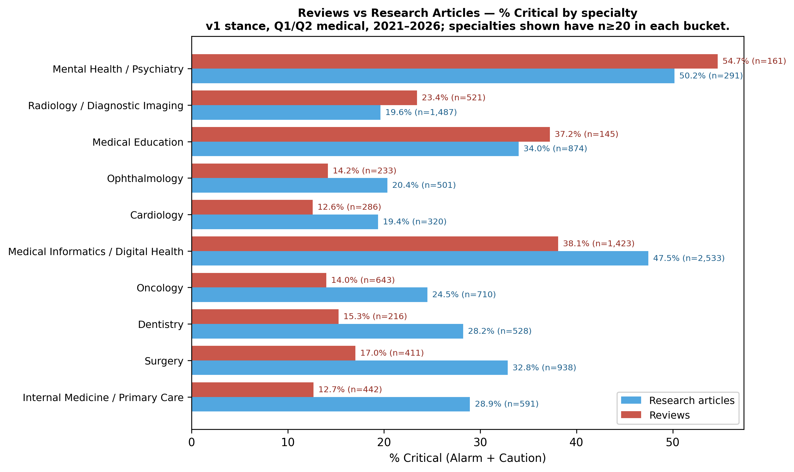

# C.3 — Reviews critical rate vs Research Articles, by specialty

Overall reviews: n=5,443, critical=24.9%.
Overall research: n=10,303, critical=32.9%.

Per-specialty breakdown (specialties with n≥20 in each bucket):

| specialty | n_review | n_research | review % crit | research % crit | Δ (rev−res) |
|---|---:|---:|---:|---:|---:|
| Internal Medicine / Primary Care | 442 | 591 | 12.7% | 28.9% | -16.3 pp |
| Surgery | 411 | 938 | 17.0% | 32.8% | -15.8 pp |
| Dentistry | 216 | 528 | 15.3% | 28.2% | -12.9 pp |
| Oncology | 643 | 710 | 14.0% | 24.5% | -10.5 pp |
| Medical Informatics / Digital Health | 1,423 | 2,533 | 38.1% | 47.5% | -9.4 pp |
| Cardiology | 286 | 320 | 12.6% | 19.4% | -6.8 pp |
| Ophthalmology | 233 | 501 | 14.2% | 20.4% | -6.2 pp |
| Medical Education | 145 | 874 | 37.2% | 34.0% | +3.3 pp |
| Radiology / Diagnostic Imaging | 521 | 1,487 | 23.4% | 19.6% | +3.8 pp |
| Mental Health / Psychiatry | 161 | 291 | 54.7% | 50.2% | +4.5 pp |

## Verdict

Reviews are consistently LESS critical than research articles across most specialties — the Session 1 reviews-positivity finding holds within-specialty. Reviews systematically dampen criticism, regardless of clinical field.

